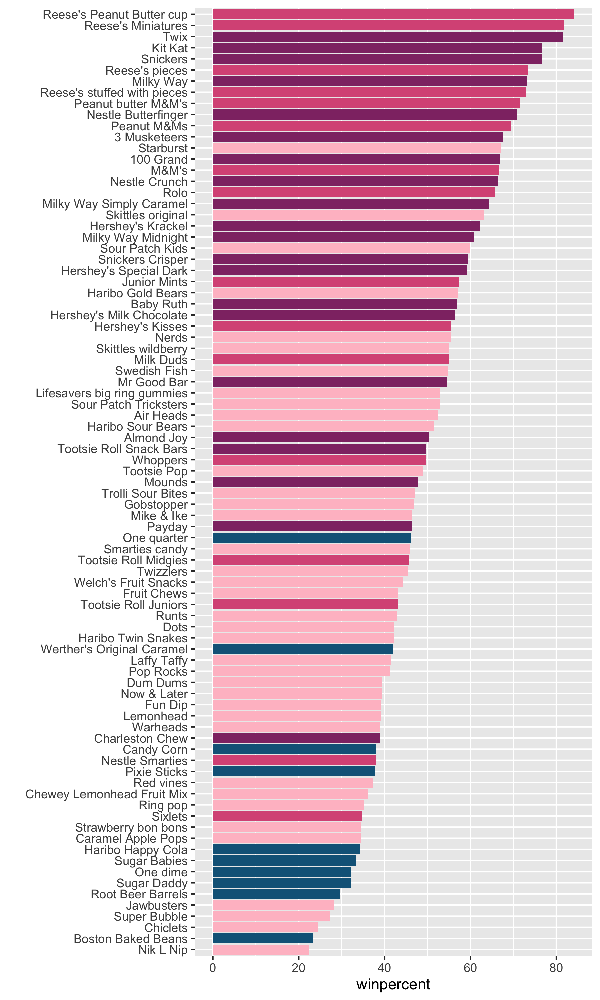

## Background

In today's mini-project we will analyze candy data with the exploratory graphics, basic statistics, correlation analysis and principal component analysis methods we have been learning thus far

## Data Import

The data comes as a CSV file from 538.

```{r}
candy <- read.csv("candy-data.csv", row.names = 1)
head(candy)
```

> Q1. How many different candy types are in this dataset?

There are `r ncol(candy)` different candy types

> Q2. How many fruity candy types are in the dataset?

There are `r sum(candy$fruity)` fruity candy types

> Q3. What is your favorite candy (other than Twix) in the dataset and what is it’s winpercent value?

My favorite candy Hershey's Kisses has win percent of 55.37545
```{r}
library(dplyr)
candy |> 
  filter(row.names(candy)=="Hershey's Kisses") |> 
  select(winpercent)
```

> Q4. What is the winpercent value for “Kit Kat”?

The win percent of Kit Kat has win percent of 76.7686
```{r}
candy |> 
  filter(row.names(candy)=="Kit Kat") |> 
  select(winpercent)
```

> Q5. What is the winpercent value for “Tootsie Roll Snack Bars”?

The win percent of Tootsie Roll Snack Bars is 49.6535
```{r}
candy |> 
  filter(row.names(candy)=="Tootsie Roll Snack Bars") |> 
  select(winpercent)
```
```{r}
library(skimr)
skim(candy)
```
> Q6. Is there any variable/column that looks to be on a different scale to the majority of the other columns in the dataset?

The column `hist` looks different than any other, it looks like a graph

> Q7. What do you think a zero and one represent for the candy$chocolate column?

It shows either a candy has chocolate in it or not, 1 means yes, 0 mean no.


## Exploratory Analysis

> Q8. Plot a histogram of winpercent values using both base R an ggplot2.

```{r}
library(ggplot2)
hist(candy$winpercent, breaks = 30)
ggplot(candy, aes(x = winpercent)) + 
  geom_histogram(binwidth = 2, col = "pink", fill = "lightblue")
```


> Q9. Is the distribution of winpercent values symmetrical?

It doesn't look quite symmetrical

> Q10. Is the center of the distribution above or below 50%?

```{r}
summary(candy$winpercent)
ggplot(candy, aes(x=winpercent)) +
  geom_boxplot()
```
The center of distribution is above 50%

> Q11. On average is chocolate candy higher or lower ranked than fruit candy?

```{r}
cho_candy <- candy$winpercent[candy$chocolate == 1]
cho <- mean(cho_candy)
fru_candy <- candy$winpercent[candy$fruity == 1]
fru <- mean(fru_candy)
print(paste("chocolate candy is" , ifelse(cho > fru, "higher", "lower") , "than fruit candy"))
```

> Q12. Is this difference statistically significant?

```{r}
t.test(cho_candy, fru_candy)
```
The difference is insignificant p-value is small 


## Overall Candy Ranking

> Q13. What are the five least liked candy types in this set?

```{r}
inds <- order(candy$winpercent)
head(candy[inds, ], 5)
```
The 5 least liked candy types are "Nik L Nip, Boston Baked Beans, Chiclets, Super Bubble, Jawbusters".

> Q14. What are the top 5 all time favorite candy types out of this set?

```{r}
inds <- order(candy$winpercent, decreasing = TRUE)
head(candy[inds, ], 5)
```
The 5 most favorite candies are "Reese's Peanut Butter cup, Reese's Miniatures, Twix, Kit Kat, Snickers"

inds <- order(candy$winpercent)
head(candy[inds, ], 5]

```{r}
ggplot(candy) +
  aes(winpercent, 
      reorder(rownames(candy), winpercent) )+
  geom_col() +
  ylab("")

ggsave("barplot2.png", height=10, width=6)
```


## Time to add some useful color

Color by chocolate:

```{r}
ggplot(candy) +
  aes(winpercent, 
      reorder(rownames(candy), winpercent),
      fill=chocolate)+
  geom_col() +
  ylab("")
```

I want custom colors that I pick so we need to make this ourselves...

```{r}
my_cols <- rep("#126388", nrow(candy))
my_cols[candy$chocolate==1] <- "#d95986"
my_cols[candy$bar==1]       <- "#903473"
my_cols[candy$fruity==1]    <- "pink"
ggplot(candy) +
  aes(winpercent, 
      reorder(rownames(candy), winpercent))+
  geom_col(fill=my_cols) +
  ylab("")
ggsave("barplot2.png", height=10, width=6)
```

> Q17. What is the worst ranked chocolate candy?

```{r}
worst <- order(candy$chocolate)
worst_name <- candy[worst, ][1, ]
worst_name
best <- order(candy$fruity)
best_name <- candy[best, ][1, ]
```

The worst ranked chocolate candy is sixlets

> Q18. What is the best ranked fruity candy?

The best ranked fruity candy is starbust

```{r}
library(ggrepel)

ggplot(candy) +
  aes(winpercent, pricepercent, label=rownames(candy)) +
  geom_point(col=my_cols) + 
  geom_text_repel(col=my_cols, size=3.3, max.overlaps = 7)
```

> Q19. Which candy type is the highest ranked in terms of winpercent for the least money - i.e. offers the most bang for your buck?

Reese's Miniatures

> Q20. What are the top 5 most expensive candy types in the dataset and of these which is the least popular?

```{r}
inds <- order(candy$pricepercent, decreasing = TRUE)
head(candy[inds, ], 5)
```
The 5 most expensive are "Nik L Nip, Nestle Smarties, Ring pop, Hershey's Krackel, Hershey's Milk Chocolate" and lest popular is Nik L Nip


## Exploring the correlation strucutre

Pearsonn correlation values range fram -1 to +1

```{r}
library(corrplot)
cij <- cor(candy)
corrplot(cij)
```
> Q22. Examining this plot what two variables are anti-correlated (i.e. have minus values)?

The fruity annd chocolate

> Q23. Similarly, what two variables are most positively correlated?

The bar and chocolate also winpercent

## Principal Component Analysis

```{r}
pca <- prcomp(candy, scale=T)
summary(pca)
```

The main results figure: the PCA score plot:

```{r}
p <- ggplot(pca$x) +
  aes(PC1, PC2, size=candy$winpercent/100, label=rownames(pca$x)) +
  geom_point(col=my_cols) +
  geom_text_repel(col=my_cols) +
  labs(title="PCA Candy Space Map")
p
```

The "loading" plot for PC1

```{r}
ggplot(pca$rotation) +
  aes(x = PC1, y = reorder(rownames(pca$rotation), PC1)) + 
  geom_col()
```

> Q24. Complete the code to generate the loadings plot above. What original variables are picked up strongly by PC1 in the positive direction? Do these make sense to you? Where did you see this relationship highlighted previously?

This makes sense, the values are bar, chocolate, winpercentage and pricepercentage

```{r}
#library(plotly)
#ggplotly(p)
```

> Q25. Based on your exploratory analysis, correlation findings, and PCA results, what combination of characteristics appears to make a “winning” candy? How do these different analyses (visualization, correlation, PCA) support or complement each other in reaching this conclusion?

A winning candy should be a bar chocolate. The price does not negativelly affect the win percentage, showing good business. The PCA supports the correlation of most chocolate are closely correlation with wins. Visualization shows clear data, and bigger circle with higher win percentage